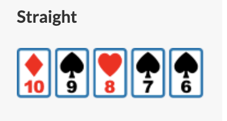

# Texas Hold'em Poker with Python

- Using TDD(Test Deriven Development)

## Rules:

- Card Ranks:

  

- Four Suits:

  

- Community Cards:

  

- Poker Hands Explained:

  | Name                                               | Explain                                                                                                                                                                                                                                                                                                                                                                                                                                                                                                              |
  | -------------------------------------------------- | -------------------------------------------------------------------------------------------------------------------------------------------------------------------------------------------------------------------------------------------------------------------------------------------------------------------------------------------------------------------------------------------------------------------------------------------------------------------------------------------------------------------- |
  |     | This is the best hand in poker. It's always A♥ K♥ Q♥ J♥ 10♥. It doesn't matter what suit it is, but all cards must be of the same suit. It's basically an ace-high straight flush.                                                                                                                                                                                                                                                                                                                                   |
  |   | A straight flush is any other hand made up of five cards of sequential rank in the same suit, such as 7♠ 6♠ 5♠ 4♠ 3♠ or Q♥ J♥ 10♥ 9♥ 8♥. If two players get a straight flush, the hand with the highest-ranking card wins. A straight flush beats four of a kind.                                                                                                                                                                                                                                                    |
  |   | A four of a kind is made up of four cards in one rank, and the last card (or 'kicker') in another rank, such as 3♣ 3♠ 3♦ 3♥ 8♥. If two players have a four of a kind, the hand with the highest-ranking four of a kind wins. If two players have the same four of a kind, the winner will be the player with the highest kicker card. A four of a kind beats a full house.                                                                                                                                           |
  |       | A full house consists of three cards of one rank and two cards of another rank, such as 9♣ 9♠ 9♦ 5♣ 5♠ (nines over fives) or Q♦ Q♠ Q♣ 2♣ 2♦ (queens over twos). If two players have a full house, the person with the highest triplet wins. If the triplet is the same, the person with the highest pair wins. A full house beats a flush.                                                                                                                                                                           |
  |            | Also called a full boat, a flush is any hand where all five cards are of the same suit. They do not need to be in sequential order. For example, K♣ 9♣ 4♣ A♣ 2♣ or 5♦ J♦ 3♦ K♦ 4♦. A flush is ranked first by the highest card, then by the second highest card, and so on. A flush beats a straight.                                                                                                                                                                                                                |
  |         | A straight is a hand that contains five cards in sequential rank, but they can be of any suit. For example, Q♦ J♦ 10♣ 9♠ 8♥ is a straight, as is 5♣ 4♠ 3♠ 2♥ A♦. If two players have a straight, the player with the highest-ranking card wins. A straight beats a three of a kind.                                                                                                                                                                                                                                  |
  |  | Sometimes called trips or a set, a three of a kind is a hand consisting of three cards of the same rank, such as 8♦ 8♠ 8♣ K♠ A♠ or Q♥ Q♠ Q♦ 2♥ 8♥. If two players have a three of a kind, the player with the highest-ranking three of a kind wins. A three of a kind beats a two pair.                                                                                                                                                                                                                              |
  |         | A two pair is a hand consisting of two cards of one rank, two cards of another rank, and the last card of another rank, such as 9♠ 9♥ 5♦ 5♥ A♠. If two players have a two-pair, the player with the highest-ranking pairs win. For example, a pair of queens and a pair of fives would beat a pair of threes and a pair of fives. If one pair is the same, the winner is determined by the second pair. If both pairs are the same, the winner of the hand is determined by the kicker. A two pair beats a one pair. |
  |         | A one pair is simply a hand that contains two cards of the same rank, such as 6♦ 6♥ 2♥ 5♠ K♣. If both players have a one pair, the player with the highest-ranking pair wins. If both pairs are the same, the player with the highest-ranking kicker wins. A one pair only beats a high card.                                                                                                                                                                                                                        |
  |        | A high card means you haven't got any of the previous hands, and so your hand will be determined by the single highest-ranking card you have. For example, if you had Q♠ 5♣ 4♦ 3♦ 2♣, you would be betting with a queen-high.                                                                                                                                                                                                                                                                                        |
  |                                                    |

## Order of Ranks:

RANKS = (
"2", "3", "4", "5", "6", "7", "8", "9", "10",
"Jack", "Queen", "King", "Ace"
)

## Order of Suits:

SUITS = ("Clubs", "Diamonds", "Hearts", "Spades")
